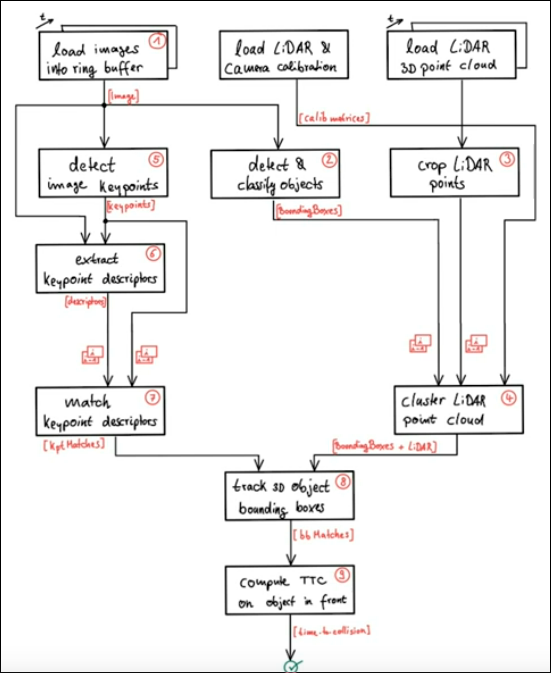
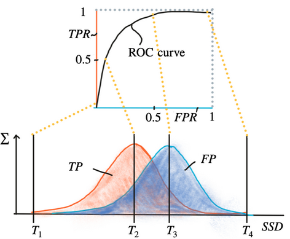
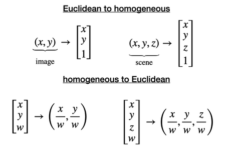

## collision avoidance

### Camera
there are two main image technologies, which are CCD (Charge-Coupled Device) and CMOS (Complementary Metal-oxide Semiconductor). Both technologies convert electrons into voltage. To enable color vision, tiny filter elements (also micro-lenses) are placed in front of each pixel which only allow a certain wavelength to pass through. One common way to map wavelength to color is to arrange the filter elements in an RGB (Red, Green, Blue) pattern to allow the primary colors to pass through individually, which gives us three individual images - one for each primary color. The most common way of arranging the RGB filters is called a Bayer pattern, which has alternating rows of red-green and green-blue filters. Unlike CCD, CMOS chips incorporate amplifiers and A/D-converters, which brings a huge cost advantage. With CCD, those components are located outside of the chip. CMOS sensors also have a faster data readout, lower power consumption, higher noise immunity, and a smaller system size.

1. Lenses and Aperture
Lens refracts all rays of light that emanate from a point P1 on an object in space such that they converge to a single point P1' in the image plane.
To reduce blurring, an aperture can be used, which is a concentric opening of usually adjustable size placed directly behind the lens.

2. distortion
radial distortion is caused by the focal length of the lens not being uniform over its diameter.
If the magnification increases, the resulting distortion effect is called pin cushion distortion. If it decreases, it is called barrel distortion instead.

#### Calibration
1. Intrinsic
https://ksimek.github.io/2013/08/13/intrinsic/
2. Extrinsic
https://ksimek.github.io/perspective_camera_toy.html
#### Feature Extraction
keypoint detector is an algorithm that chooses points from an image based on a local maximum of a function;  descriptor is a vector of values, which describes the image patch around a keypoint
1. Gaussian Smoothing
1) standard deviation
2) kernel size
2. Sobel operator
3. Harris detector 
Harris detector is robust under rotation and additive intensity shifts, but sensitive to scale change, multiplicative intensity shifts (i.e. changes in contrast) and affine transformations. modern detector has tackled the problem with Automatic Scale Selection
4. Histograms of Oriented Gradients (HOG) based descriptor
1) Scale-Invariant Feature Transform (SIFT)
2) Binary Descriptors
3) Binary Robust Invariant Scalable Keypoints (BRISK)
4) Features from Accelerated Segments Test (FAST)
5) Binary Robust Independent Elementary Features (BRIEF)
6) ORB(opens in a new tab) is a combination of Oriented FAST and Rotated BRIEF
5. Descriptor Matching
you have to adapt the distance measure to the type of descriptor you are using. In case of gradient-based methods such as SIFT, the L2-norm would be most appropriate. In the case of all binary descriptors, the Hamming distance should be used.
6. Performance Evaluation

### Lidar

### Fusion
homogeneous coordinates: Homogeneous coordinates add an extra dimension to Cartesian coordinates, allowing points to be represented in a higher-dimensional space. This extra dimension simplifies mathematical operations, especially transformations.

### Detection
#### Traditional
HOG/SVM
#### Deep Learning
YOLO looks at the whole image so its predictions are informed by global context in the image. It also makes predictions with a single network pass unlike systems like R-CNN which require thousands of passes for a single image.

### Tracking
