## collision avoidance

### Camera
there are two main image technologies, which are CCD (Charge-Coupled Device) and CMOS (Complementary Metal-oxide Semiconductor). Both technologies convert electrons into voltage. To enable color vision, tiny filter elements (also micro-lenses) are placed in front of each pixel which only allow a certain wavelength to pass through. One common way to map wavelength to color is to arrange the filter elements in an RGB (Red, Green, Blue) pattern to allow the primary colors to pass through individually, which gives us three individual images - one for each primary color. The most common way of arranging the RGB filters is called a Bayer pattern, which has alternating rows of red-green and green-blue filters. Unlike CCD, CMOS chips incorporate amplifiers and A/D-converters, which brings a huge cost advantage. With CCD, those components are located outside of the chip. CMOS sensors also have a faster data readout, lower power consumption, higher noise immunity, and a smaller system size.

1. Lenses and Aperture
Lens refracts all rays of light that emanate from a point P1 on an object in space such that they converge to a single point P1' in the image plane.
To reduce blurring, an aperture can be used, which is a concentric opening of usually adjustable size placed directly behind the lens.

2. distortion
radial distortion is caused by the focal length of the lens not being uniform over its diameter.
If the magnification increases, the resulting distortion effect is called pin cushion distortion. If it decreases, it is called barrel distortion instead.

#### Calibration
1. Intrinsic
https://ksimek.github.io/2013/08/13/intrinsic/
2. Extrinsic
https://ksimek.github.io/perspective_camera_toy.html
#### Feature Extraction
keypoint detector is an algorithm that chooses points from an image based on a local maximum of a function;  descriptor is a vector of values, which describes the image patch around a keypoint
1. Gaussian Smoothing
1) standard deviation
2) kernel size
2. Sobel operator
3. Harris detector 
Harris detector is robust under rotation and additive intensity shifts, but sensitive to scale change, multiplicative intensity shifts (i.e. changes in contrast) and affine transformations. modern detector has tackled the problem with Automatic Scale Selection
4. Histograms of Oriented Gradients (HOG) based descriptor
1) Scale-Invariant Feature Transform (SIFT)
2) Binary Descriptors
3) Binary Robust Invariant Scalable Keypoints (BRISK)
4) Features from Accelerated Segments Test (FAST)
5) Binary Robust Independent Elementary Features (BRIEF)
6) ORB(opens in a new tab) is a combination of Oriented FAST and Rotated BRIEF
5. Descriptor Matching
you have to adapt the distance measure to the type of descriptor you are using. In case of gradient-based methods such as SIFT, the L2-norm would be most appropriate. In the case of all binary descriptors, the Hamming distance should be used.
6. Performance Evaluation

### Lidar

### Radar
Radar can determine the targets at long range with accurate velocity and spatial information, which is very useful for static/dynamic object detection. its capability to sense objects in dark and poor weather (rain, fog) conditions also help it cover the domains where LIDAR or camera may fail.
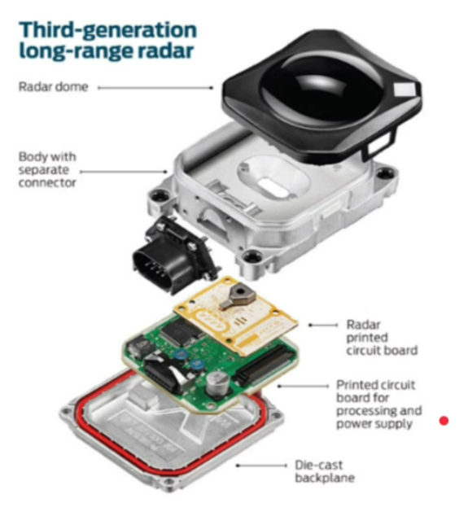
The automotive radar generally operates at W band (76GHz - 81GHz). The signal at this frequency is referred to as millimeterWave since the wavelength is in mm.
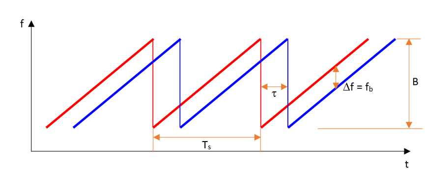
FMCW radar (Frequency-Modulated Continuous Wave radar) is a special type of radar sensor which radiates continuous transmission power. FMCW radar’s ability to measure very small ranges to the target as well as its ability to measure simultaneously the target range and its relative velocity makes it the first choice type of radar for automotive applications.
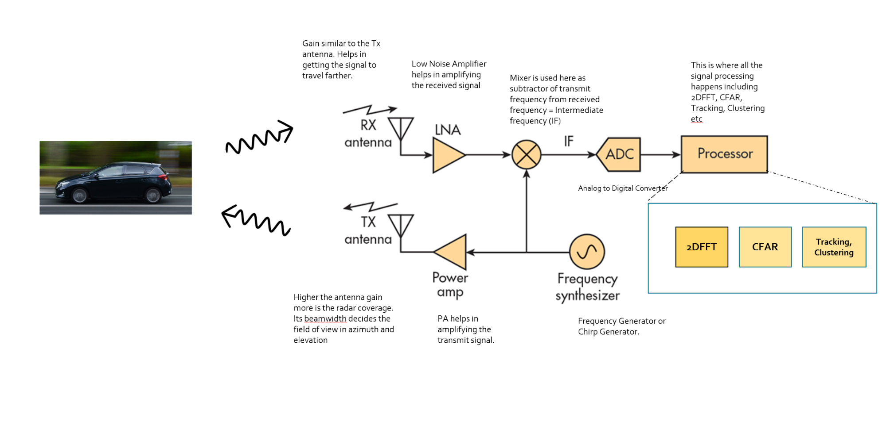
The antenna pattern is the geometric pattern of the strengths of the relative field emitted by the antenna.
The beamwidth of the antenna determines the field of view for the radar sensor. If the requirement for the radar is to just sense the targets in its own lane then the beamwidth needs to be small enough to cover the complete lane up to desired range. If the beamwidth is wider than the lane width, it will sense the targets in the other lanes as well.
Antenna radiation not only comprises of the main beam but the sidelobes as well. Antenna sidelobes are critical because they can generate false alarms and pick interference from undesired direction. As seen in the pattern, the sidelobes of the antenna point in different directions and can sense targets that are not in the main beam. To avoid sidelobe detections it is critical to suppress the sidelobe levels to more than 30dB from the peak of the main beam.
There are many types of antenna (dipole, patch, horn) that can be used at 77GHz, but the most commonly used antenna type in automotive radar is the patch antenna . The low cost, easy fabrication, and low profile of Patch Array Antennas makes them an ideal choice for automotive radar applications.
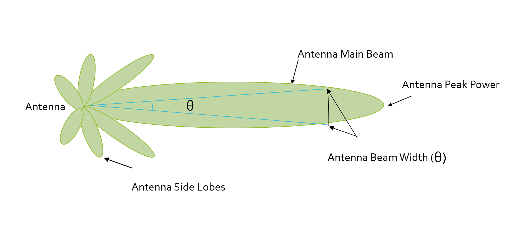
The size and ability of a target to reflect radar energy is defined by a single term, σ known as the radar cross-section, which has units of m2. This unit shows that the radar cross section is an area. The target radar cross sectional area depends on:
- The target’s physical geometry and exterior features:
    - Smooth edges or surface would scatter the waves in all directions, hence lower RCS. Whereas, sharp corners will focus the return signal back in the direction of the source leading to higher RCS. (Image below for different target geometries)
- The direction of the illuminating radar,
- The radar transmitter’s frequency,
- The material used in the cars, trucks, bicycles, and even in some cases, the clothing material for pedestrians.
This RCS can also be defined using a logarithmic value (dB), since it increases the return signal strength. The formula for converting from RCS to dB is given by: RCSdB=10log⁡(RCSm2).

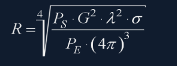
- R - Maximum Range a radar can detect targets.
- Ps​ - Transmitted Power from Radar (dBm)
- G - Gain of the Transmit/Receive Antenna (dBi)
- λ - Wavelength of the signal (mm)
- σ - radar cross section (m2m2)
- PEP - Minimum received power radar can detect.

SNR is a quantitative measure of a signal strength as compared to the level of noise. If the SNR is too low it becomes difficult for a radar to distinguish the signal from noise. Hence, higher SNR is desirable for successful detection of the target. Generally, a 7-13 dB SNR ensures successful detection in a road scenario.

#### Range Doppler Estimation
Capability of a radar to resolve two targets based on differences in their distance, angle and velocity.
- Range Resolution: It is the capability of the radar to distinguish between two targets that are very close to each other in range. If a radar has range resolution of 4 meters then it cannot separate on range basis a pedestrian standing 1 m away from the car.
The range resolution is solely dependent on the bandwidth of the chirp BsweepBsweep​: dres=c2Bsweep
- Velocity Resolution: If two targets have the same range they can still be resolved if they are traveling at different velocities. The velocity resolution is dependent on the number of chirps. As discussed for our case we selected to send 128 chirps. A higher number of chirps increases the velocity resolution, but it also takes longer to process the signal.
- Angle Resolution: Radar is capable of separating two targets spatially. If two targets are at similar range travelling at same velocities, then they can still be resolved based on their angle in radar coordinate system. Angle resolution depends on different parameters depending on the angle estimation technique used. We will cover this in more detail in the next lesson.
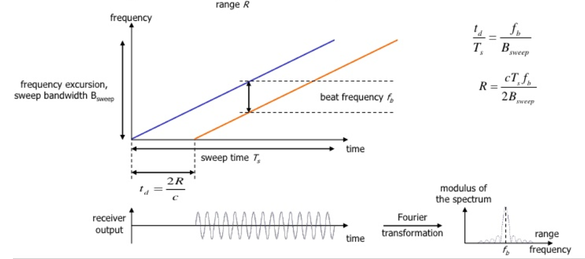
the Synthesizer generates FMCW chirp for a given BsweepBsweep​ and TsTs​. Let’s say the signal gets transmitted at 77GHz and it returns to the radar after hitting the target in a certain time duration. The radar receiver captures the signal, processes (subtraction) and measures the frequency delta between received signal and linearly ramping signal. This delta in frequency is called as beat frequency and it is proportional to the trip time.
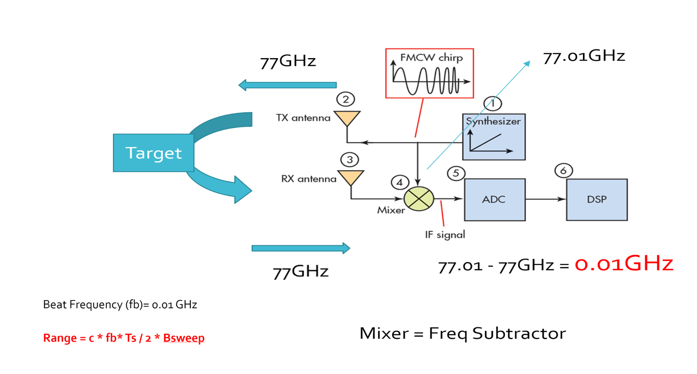

there will be a shift in the received signal frequency due to the doppler effect of the target’s velocity. The doppler shift is directly proportional to the velocity of the target as shown below.
fD=2νr/λ
    - fD​: shift in the transmitted frequency due to the doppler
    - νr: relative velocity of the target
    - λ: wavelength of the signal
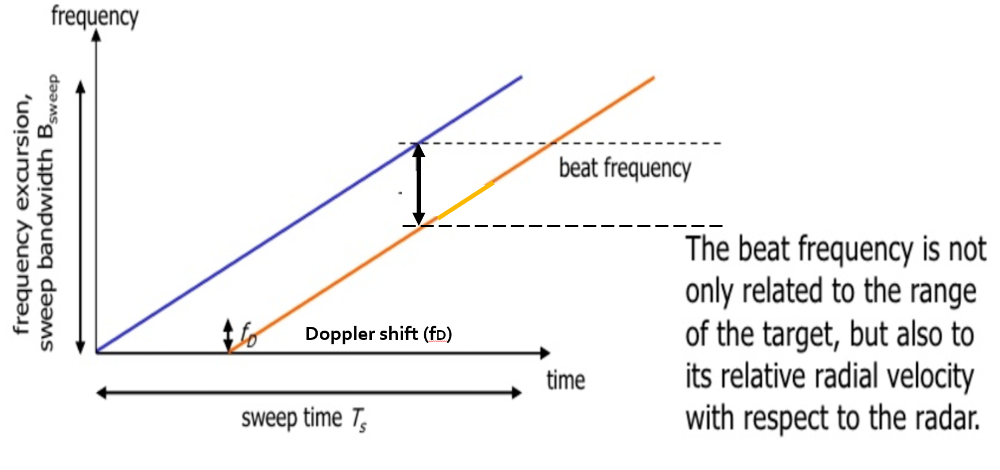

FFT
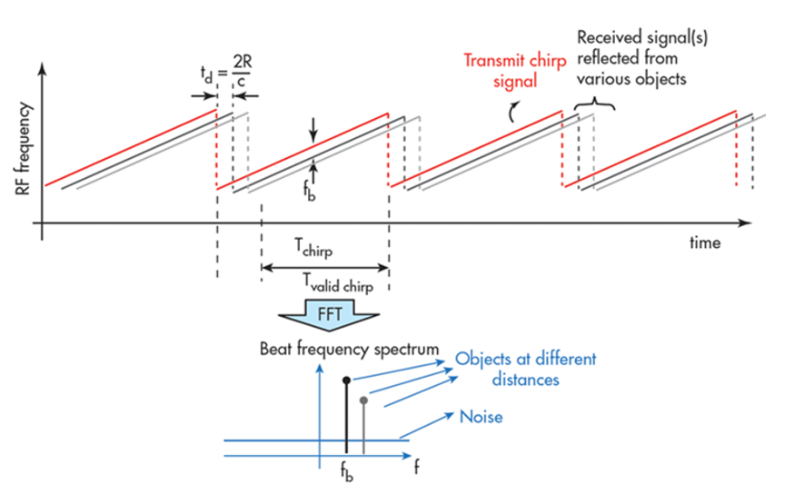
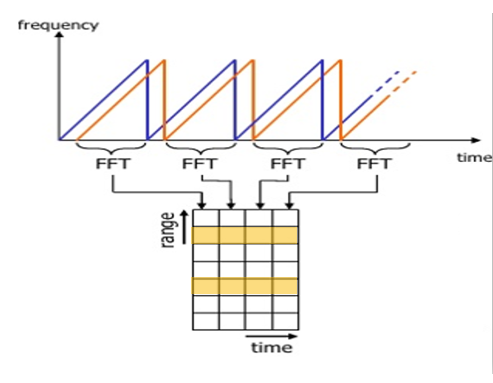
the Range FFTs are run for every sample on each chirp. Since each chirp is sampled N times, it will generate a range FFT block of N * (Number of chirps). These FFT blocks are also called FFT bins.

2D FFT
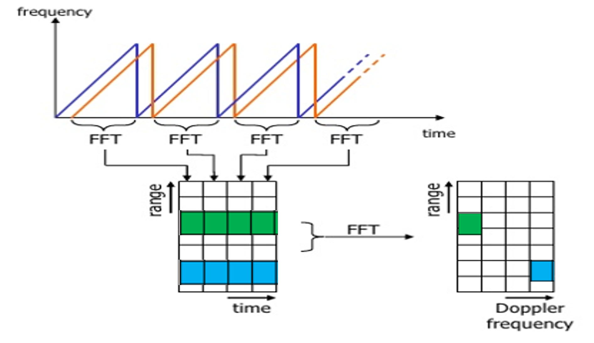
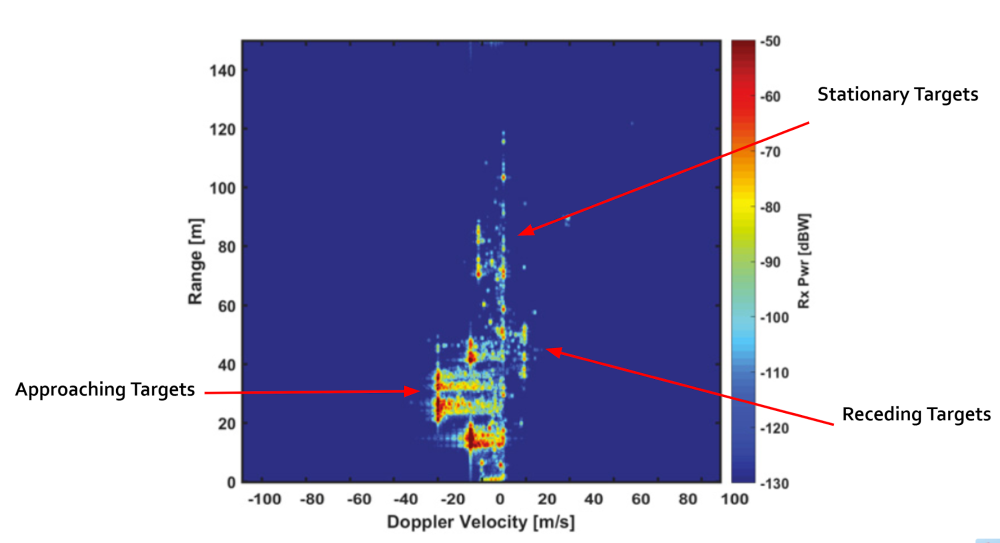
Once the range bins are determined by running range FFT across all the chirps, a second FFT is implemented along the second dimension to determine the doppler frequency shift. As discussed, the doppler is estimated by processing the rate of change of phase across multiple chirps. Hence, the doppler FFT is implemented after all the chirps in the segment are sent and range FFTs are run on them.
The output of the first FFT gives the beat frequency, amplitude, and phase for each target. This phase varies as we move from one chirp to another (one bin to another on each row) due to the target’s small displacements. Once the second FFT is implemented it determines the rate of change of phase, which is nothing but the doppler frequency shift.

#### Clutter
The backscatter from these unwanted sources is called as clutter.
- One technique to remove clutter is to remove the signals having 0 doppler velocity. Since, the clutter in the driving scenario are often created by the stationary targets, the 0 doppler filtering can help get rid of them.
The downside of 0 doppler filtering is that the radar would not be able to detect the stationary targets in its path. This would lead to detection failures.
- Another technique is to use fixed clutter thresholding. With fixed thresholding, signal below the threshold value is rejected. With this method, if the detection threshold is set too high, there will be very few false alarms, but it will also mask the valid targets. If the threshold is set too low, then it would lead to too many false alarms. In other words, the false alarm rate would be too high.
The false alarm rate is the rate of erroneous radar detections by noise or other interfering signals. It is a measure of the presence of detected radar targets when there is no valid target present.
- Another approach to clutter thresholding is to use dynamic thresholding. Dynamic thresholding involves varying the threshold level to reduce the false alarm rate, which is called CFAR (Constant False Alarm Rate).
1. CFAR
 CFAR varies the detection threshold based on the vehicle surroundings. The CFAR technique estimates the level of interference in radar range and doppler cells “Training Cells” on either or both the side of the “Cell Under Test”. The estimate is then used to decide if the target is in the Cell Under Test (CUT).
    - Cell Averaging CFAR (CA-CFAR)
    - Ordered Statistics CFAR (OS CFAR)
    - Maximum Minimum Statistic (MAMIS CFAR)
    - multiple variants of CA-CFAR.

CA-CFAR
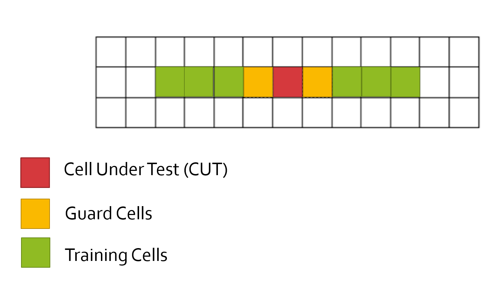
Cell Under Test : The cell that is tested to detect the presence of the target by comparing the signal level against the noise estimate (threshold).
Training Cells : The level of noise is measured over the Training Cells. The Training Cells can be divided into two regions, the cells lagging the CUT, called lagging Training Cells and the cells leading the CUT, called Leading Training Cells. The noise is estimated by averaging the noise under the training cells. In some cases either leading or lagging cell average is taken, while in the other the leading and lagging cell average is combined and the higher of two is considered for noise level estimate.
The number of training cells should be decided based on the environment. If a dense traffic scenario then the fewer training cells should be used, as closely spaced targets can impact the noise estimate.
Guard Cells : The cells just next to CUT are assigned as Guard Cells. The purpose of the Guard Cells is to avoid the target signal from leaking into the training cells that could adversely affect the noise estimate. The number of guard cells should be decided based on the leakage of the target signal out of the cell under test. If target reflections are strong they often get into surrounding bins.
Threshold Factor (Offset) : Use an offset value to scale the noise threshold. If the signal strength is defined in logarithmic form then add this offset value to the average noise estimate, else multiply it.
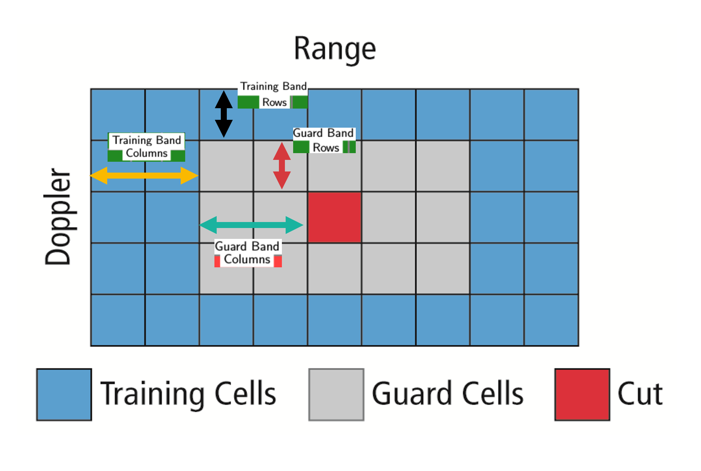

#### Angle of Arrival
A phased array antenna is an antenna array that steers the beam electronically in the desired direction. The array steers the beam if each antenna element in an array is excited by the signal with certain phase values. This phenomenon is referred to as beam scanning.

### Fusion
homogeneous coordinates: Homogeneous coordinates add an extra dimension to Cartesian coordinates, allowing points to be represented in a higher-dimensional space. This extra dimension simplifies mathematical operations, especially transformations.

### Detection
#### Traditional
HOG/SVM
#### Deep Learning
YOLO looks at the whole image so its predictions are informed by global context in the image. It also makes predictions with a single network pass unlike systems like R-CNN which require thousands of passes for a single image.

### Tracking

